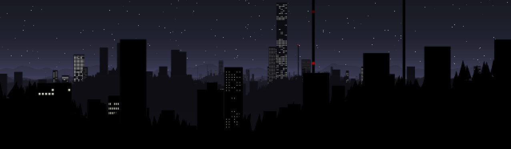

# Scrolly1

This is a Java program I wrote over a couple of long evenings
in order to answer the question:
If we draw a bunch of objects as black silhouettes (with lights)
between layers of fog, does it look super cool?

The answer is a resounding yes.



This was intended to run as an applet
(back when they still ran in web browsers),
but can also run stand-alone, like so (once compiled):

```sh
java -cp target togos.scrolly1.ScrollyApplet
```

If LWJGL is available, it can be used for for smoother rendering:

```bat
java -Djava.library.path=%lwjgl_path%\native\windows -cp %lwjgl_path%\jar\lwjgl.jar;target togos.scrolly1.lwjgl.LWJGLScrollyCanvas
```

Adjust as necessary for non-Windows platforms.

Keyboard controls:
- H - Toggle anti-aliasing on/off
- G - Cycle through detail modes
- F - Change fog opacity
- B - Change fog brightness
- C - Randomize fog color
- L - Switch between normal / simplified / no skyscraper window lights
- arrow keys - Accelerate the camera in X and Y directions
- '[', ']' - Accelerate the camera in -Z and +Z directions
- space bar - Immediately halt camera movement
